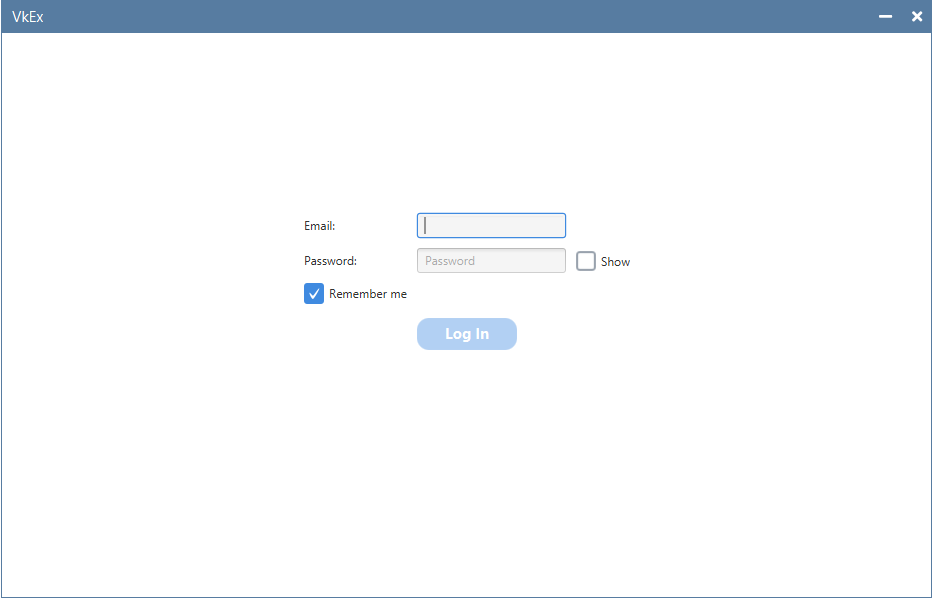
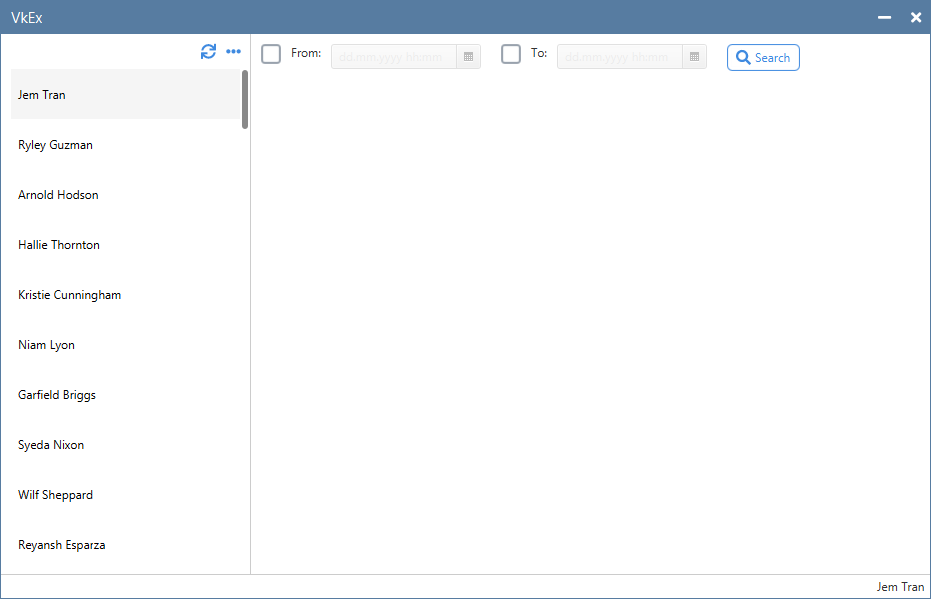
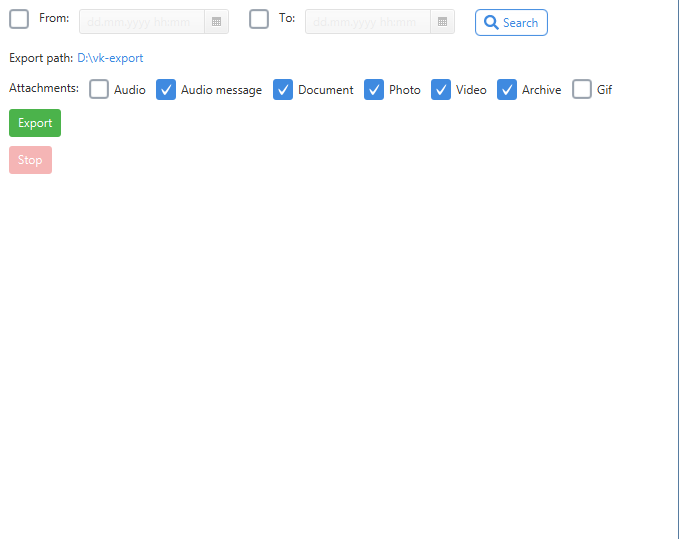
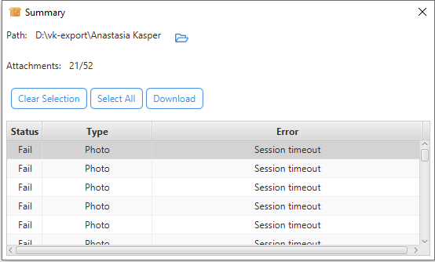

# VkEx (Vkontakte Export)
VkEx is a combination of desktop and console applications that aim to allow Vkontakte users to export their conversations.
## History
Vkontakte is a very popular social network. 
It has a lot of cool features and allows users to communicate, 
share different types of data: videos, photos, documents, etc.

Unfortunately, Vkontakte doesn't provide any good way to download shared data.
And this is a big problem because it's really painful when someone from your friends shares a lot of photos from the past party and you need to download some | all of them.

This application aims to solve this problem by providing a convenient way to export your data.

## Key features
* All data goes through the user's computer (without any 3-d party services)
* User can select what attachment types he(she) wants to export
* User can select a period for attachments to export

## Limitations
* Only English locale for now
* 2-step verification isn't supported
* Only installer for Windows is available. Installers for MacOs and Linux will be added in the upcoming releases
* Messages cannot be exported

## Desktop Application
### Screenshots:
***

***

***

***

